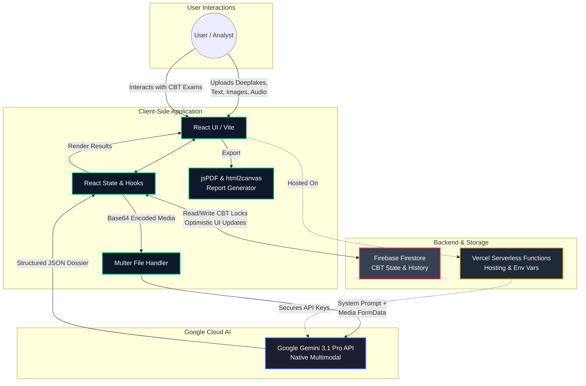

# VERITAS: Virtual Evidence Reconstruction & Intelligence Tracking Analysis System

## Inspiration

With the explosive growth of Generative AI, the line between reality and digital fabrication has never been thinner. Deepfakes, synthetic audio, and AI-generated text are being weaponized for misinformation at an unprecedented scale. We realized that traditional fact-checking tools are too slow and single-modal to combat this. We needed an automated, real-time forensic agent capable of parsing text, images, audio, and video simultaneously—just like a human investigator, but with the speed and precision of AI. This inspired **VERITAS** (Virtual Evidence Reconstruction & Intelligence Tracking Analysis System), an advanced multimodal forensic deconstruction agent designed to expose the truth behind synthetic media.

## What it does

VERITAS acts as a unified cyber-forensic dashboard for analysts, journalists, and everyday users. It features two primary modes:

1. **Forensic Form**: Users can upload suspicious artifacts—viral quotes, deepfake videos, altered audio clips, or URLs. VERITAS analyzes the multimodal context and outputs a comprehensive "Forensic Dossier". This dossier includes a threat level assessment, an executive conclusion, and step-by-step narrative evidence (e.g., highlighting spatial lighting inconsistencies in an image, detecting GAN-based lip-sync artifacts in video, or revealing voice stress anomalies in audio). The findings can be natively exported into a secure PDF.
2. **Live Interrogation**: A real-time analysis environment for live streaming media and ongoing investigations.

Additionally, we implemented a **Two-Part CBT (Computer-Based Training) module** to train analysts, complete with an admin dashboard for tracking assessment readiness.

## How we built it

We architected VERITAS using a modern, scalable web stack.
The **frontend** is built with **React, TypeScript, and Vite**, utilizing **Tailwind CSS** for a sleek, cyber-forensic UI, and **Framer Motion** for fluid micro-animations.

The core intelligence is powered by **Google's Gemini 3.1 Pro** API. We heavily leveraged Gemini's native multimodal capabilities, allowing us to pass images, audio, and text simultaneously in a single prompt context. We engineered a strict system instruction set to force the model into a clinical, forensic persona that outputs structured JSON dossiers.

For the **backend & database**, we used **Node.js, Express, and Firebase/Firestore** to handle application state, store analysis history, and sync the CBT assessment locks in real-time. We also built a custom **"Director Mode" plugin console** to orchestrate seamless product demonstrations and UI state overrides directly from the browser window.

## Challenges we ran into

Integrating native multimodal processing was a significant hurdle. Handling large media files from the client-side required optimal Base64 encoding and chunking strategies before sending them to the Gemini API.

Another major challenge was enforcing structured JSON output from a complex, creative prompt across various media types. We had to iterate extensively on our prompt engineering to ensure the model reliably generated the exact schema required for rendering our custom UI components (like `spatial_pointing` markers or `derender_code` blocks).

Lastly, transitioning from a mocked testing backend to a full production environment with real file uploads required careful handling of asynchronous data states and securing Vercel deployment environment variables.

## Accomplishments that we're proud of

We are incredibly proud of the **Live Dossier Generation**. Watching VERITAS ingest a complex, deepfake video and autonomously generate a clinical, frame-by-frame breakdown of spatial and spectral anomalies feels like magic.

We are also extremely proud of the **UI/UX design**. We achieved a highly immersive, "hacker-chic" yet professional aesthetic—complete with dynamic scan lines, glowing accents, thinking mode toggles, and seamless PDF report generation—that makes the user feel like a true digital detective.

## What we learned

Building VERITAS opened our eyes to the immense power of Native Multimodal AI. We learned that when an LLM can natively "see" and "hear" media rather than rely on intermediate transcription models, its contextual reasoning capabilities improve exponentially. We also learned valuable lessons in robust state management in React, handling optimistic UI updates during database latency, and managing complex real-time API integrations.

## What's next for Veritas

We plan to integrate VERITAS as a browser extension, allowing instant background verification of social media posts, videos, and news articles directly in the user's feed. We're also exploring integrating blockchain-based hashing to establish digital provenance for the generated dossiers, ensuring the forensic reports themselves can never be tampered with.

## Built with

- **Languages:** TypeScript, JavaScript, HTML5, CSS3
- **Frameworks & Libraries:** React 19, Vite, Tailwind CSS V4, Framer Motion, Express.js
- **Cloud Services & APIs:** Google Gemini 3.1 Pro API, Firebase (Firestore), Vercel
- **Tools & Utilities:** Node.js, Lucide-React (Icons), html2canvas & jsPDF (Exporting), Multer (File Handling)

---

### Run Locally

**Prerequisites:** Node.js

1. Install dependencies:
   `npm install`
2. Set the `VITE_GEMINI_API_KEY` in `.env` to your Gemini API key.
3. Run the app:
   `npm run dev`

---

## Architecture Diagram

